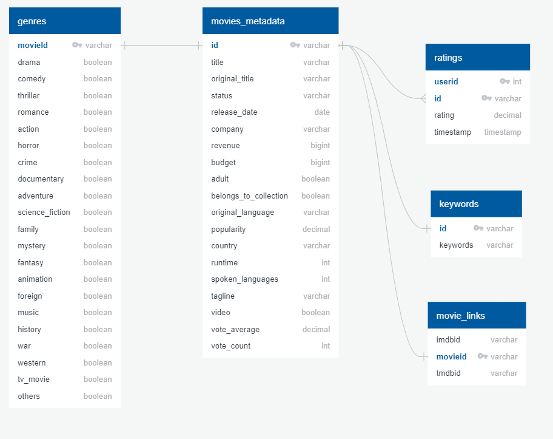

# Analysis of the Kaggle Movies Dataset 

The Data was sourced from Kaggle.com "The Movies Dataset" https://www.kaggle.com/rounakbanik/the-movies-dataset.

## Roles
This project is a collaborative effort amongst cohorts.

      Presentation: Jeff https://github.com/JeffHastings
      Database/Github: Pam https://github.com/mspamelalea
      Machine Learning: Matthew https://github.com/MatthewTichenor
      Dashboard: Steven https://github.com/Snicho1945
      Test/Review: All

Our purpose is to determine the optimal release dates for movies based on the time of year and genre.
This information could help the entertainment industry maximize gains made from movies as well as be an important tool for independent studios lacking a big budget.

Find all the tools used for this project in the [requirements.txt file.](https://github.com/Snicho1945/Final_Project/blob/main/requirements.txt)

##  **Presentation** 
The presentation is a work-in-progress that is being updated as the project changes and grows. It has been prepared in Google Slides. The latest version of our presentation now includes images from the Tableau dashboard:
- Budget vs Revenue by Month
- By Country Heatmap
- Revenue by Genre by Month
- Distribution of films by month

[Click here for the presentation.](https://docs.google.com/presentation/d/1Hq-Y0TJ5y4ZmTBVe_Reaw9OvmiGiBZfVirvh4pVBBxY/edit?usp=sharing)

## **Database**
The database is a PostgreSQL relational database hosted on AWS. pgAdmin4 was used to build and manipulate the database. Code for this is found in the [SQLdbScripts ](https://github.com/Snicho1945/Final_Project/tree/main/SQLdbScripts)folder. The data was pulled in from the provided csv files using Python/Pandas in a Jupyter Notebook. Sample code for retreiving data and joining tables can be found in the [Resources ](https://github.com/Snicho1945/Final_Project/tree/main/Resources)folder. The code for this and some subsequent data cleanup are in [clean_movie_metadata.ipynb](https://github.com/Snicho1945/Final_Project/blob/main/clean_movie_metadata.ipynb). 
__Database Access__: We access the database for analysis by using ___psycopg2___ library and setting cursors to hold the data within Jupyter Notebook.  This code is inclued in the [Linear_Regression_ML_Analysis.ipynb](https://github.com/Snicho1945/Final_Project/blob/main/Linear_Regression_ML_Analysis.ipynb) notebook.
 
 There are 5 tables housing the data as shown in this QuickDB ERD:

### Data Exploration for Database Load
The database has five tables.
1. ___movies_metadata___ - This is the main, driving table.  It contains basic information about the movie including title, release date, production company and revenue. 

Columns with zero revenue were dropped because our ML analysis depends on revenue-generating movies. Duplicates in the "id" column were dropped. Columns we would not need for our analysis were dropped: "imdb_id", "homepage", "poster_path", and "overview". The "release_date" column was converted to a datetime data type.

The "belongs_to_collection" column was converted to a boolean type. If there was a non-null value in the column, it was set to True.

The "production_companies" column was a list of dictionaries. Some movies had multiple production companies.  We determined that the first production company listed was the most significant so we used that one to load to the company column.

The "production_countries" column was a list of dictionaries.  Some movies had multiple production countries.  Since production country was not important to our analysis, we put just the first country in the column.

The "spoken_languages" column was a list of dictionaries.  Some movies had multiple languages.  Since language was not important to our analysis, we put just the first language in the column.

2. ___genres___ - This table came from the genres column of the movies_metatdata dataset.  The column was a list of dictionaries with the various genres of the movie listed.  This column has been broken out into a separte id-driven table with the possible genres as columns.  Each genre column is boolean to indicate if that movie is in that genre.

3. ___ratings___ - This table has the "userid" and the "id" as the key fields with the "id" having a many-to-one relationship with the movies_metadata table.  The movieId was converted to a string type and "timestamp" was converted to a datetime data type. NaNs were dropped.

4. ___keywords___ - This table has an "id" field with a many-to-one relationship to movies_metadata.  The "id" was converted to string type and NaNs were dropped.  The keywords field is converted from a list of dictionaries to just a list containing the keywords for that movie.  Duplicate "id" rows were dropped.

 5. ___links___ -  This table is included for future exploration.  If we wanted to included datasets from other sources, this table has the imdb id for joining.

## **Machine Learning** 

### Machine Learning Models
For the final project we steered away from descision tree and random forest which was the direction the team wanted to test the models in the machine model. The new direction in which we will but the models in will be cross viladation and neural network models. Model 1 and model 2 will ran with cross viladation which is a statistical method used to estimate the skill of machine learning models. The pros of using cross viladation is easy to understand, easy to implement, and results in skill estimates that generally have a lower bias than other methods. The negative side of using this model is that with using Cross Validation the user drastically increases the training time of the model. Earlier you had to train your model only on one training set, but with Cross Validation you have to train your model on multiple training sets. Model 3 we will be using nueral network to focus the machine learning base on the genres and how revenue effect the succes of the genres in our data frame. Nueral network model is a computational learning system that uses a network of functions to understand and translate a data input of one form into a desired output, usually in another form. The pros of using Nueral network is it has the ability to learn by themselves and produce the output that is not limited to the input provided to them. The input of the network is stored in its own networks instead of a database, hence the loss of data does not affect its working. The downside of using this type of machine learning is that it usually require much more data than traditional machine learning algorithms, as in at least thousands if not millions of labeled samples. This isn't an easy problem to deal with and many machine learning problems can be solved well with less data if you use other algorithms.

### Model Scores
Model scores and how they relate to our test variable
The data collected in model 1 which looks into the columns in the data frame and test it through the variable revenue. The regression score is 0.5430834757292722 which is a postive result. 

The results when the lasso test running is .5423760475256304 which is close to the regression score and the ridge score is 0.5492908370454095. 

When combining the two and run the elastic net we and we get 0.4731431344863092. All test results are in the same ball park. We can detrimine the revenue can not soley predict the success of the outcome of the movie.

Model two focuses on the variable month and how revenue may effect the success. The regression score is 0.00140294244387984. Though this is a postive interger. We note that this score is less than one and that the month of year truly can not show much how success the movie recieves in revenue.

Model three which is the variable genres and testing how revuene play the regression score is 0.00140294244387984. The lasso score is 0.018623876691926555. Noting that both less than 1 percent the genre still is not a major factor in the succes of the movie.

### Dataframe Visual File

This file was created to read the data frame and showcase a couple of graphs that will paint the picture of the data. In the file, the reader will see bar graphs and scatter graphs. The bar graphs showcase important column trends that we as a team would like to highlight. the heatmap is showcasing the trends within the statics of the data. Lastly, the scatter chart shows the relationships of the columns that are important for answering the research question.

 ## **Dashboard** 
- Tableau will used for the dashboard 
- Mosaic chart depicting studio revenue and picture count
- Graph depicting movie success by release date with genre (Top 3)
- Graphs from Machine Learning
      - Correlation Chart
      - Linear regression for Feature vs Revenue
- Breakdown of monthly budget and revenue
- [Click here for Film Release Date Analysis](https://public.tableau.com/profile/steven.nichols#!/vizhome/FilmReleaseDateAnalysis_16050462264500/FilmReleaseDateAnalysis)
- [Click here for FRDA Data](https://public.tableau.com/profile/steven.nichols#!/vizhome/FRDAAllData/Action)

