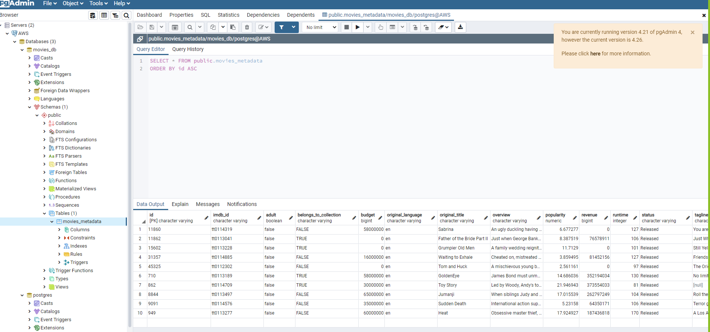

# Final_Project
## Segment 2
### Database Notes
The updated ERD:

Because we wanted to use Jupyter Notebook instead of Google Colab, we have changed the way we access the database by using psycopg2 and setting cursors to hold the data within Jupyter Notebook. The  connection string and sample cursor/SQL code can be found in the connect_to_db.ipynb file. 

In order to fetch from the cursor, Jupyter Notebook had to be started with this command:

jupyter notebook --NotebookApp.iopub_data_rate_limit=2147483647

### Data Exploration
The database now holds four tables.
1. movies_metadata - This is the main, driving table.  It contains basic information about the movie including title, release date, production company and revenue. 

Columns with zero revenue were dropped because our analysis depends on revenue-generating movies. Duplicates in the "id" column were dropped. Columns we would not need for our analysis were dropped: "imdb_id", "homepage", "poster_path", and "overview". The "release_date" column was converted to a datetime data type.

The "belongs_to_collection" column was converted to a boolean type. If there was a non-null value in the column, it was set to True.

The "production_companies" column was a list of dictionaries. Some movies had multiple production companies.  We determined that the first production company listed was the most significant so we used that one to load to the company column.

The "production_countries" column was a list of dictionaries.  Some movies had multiple production countries.  Since production country was not important to our analysis, we put just the first country in the column.

The "spoken_languages" column was a list of dictionaries.  Some movies had multiple languages.  Since language was not important to our analysis, we put just the first language in the column.

2. genres - This table came from the genres column of the movies_metatdata dataset.  The column was a list of dictionaries with the various genres of the movie listed.  This column has been broken out into a separte id-driven table with the possible genres as columns.  Each genre column is boolean to indicate if that movie is in that genre.

3. ratings - This table has the "userid" and the "movieId" (later, "id") as the key fields with the "id' having a many-to-one relationship with the movies_metadata table.  The movieId was converted to a string type and "timestamp" was converted to a datetime data type. NaNs were dropped.

4. keywords - This table has an "id" field with a many-to-one relationship to movies_metadata.  The "id" was converted to string type and NaNs were dropped.  The keywords field is converted from a list of dictionaries to just a list containing the keywords for that movie.  Duplicate "id" rows were dropped.

5. credits - we have not yet determined if we need this table for our analysis.

## Segment 1
### Database Notes
I've pushed several files to my branch.
1. MoviesERD_2.PNG is a diagram of the downloaded movie files and how they relate to one another. I'll update this diagram as the database develops.

2. Resources/movies_erd_code.txt is the code used to build the ERD in QuickDB

3. clean_movie_metadata.ipynb is a notebook with several of the columns cleaned up for loading to the database which is hosted on AWS. We will be dropping many of these columns as they are not relevant to our project goal.  I will update as we work through which columns are needed.

  - The "belongs_to_collection" was converted from a dictionary to a boolean.  If there is data in that column for a row, it is assigned True.  Otherwise, it is False.
  - The "genres" column is converted from a list of dictionaries to 11 columns representing the 10 genres plus an "others' column.  If the genre is in the "genres" column, its corresponding column is marked True.
  -  The "spoken_languages" column is converted from a list of dictionaries to a count of languages for that movie.
  - Coding started for unpacking the "production_companies" column.  We think this will be one of the most important columns in the database.
4. Google Colab has the code to connect to the database on AWS. Here's the link:
https://colab.research.google.com/drive/13_1UyDf0L24geuSm_P4nfJNhYh0hSisM?usp=sharing

Our database can be seen here on pgAdmin:

